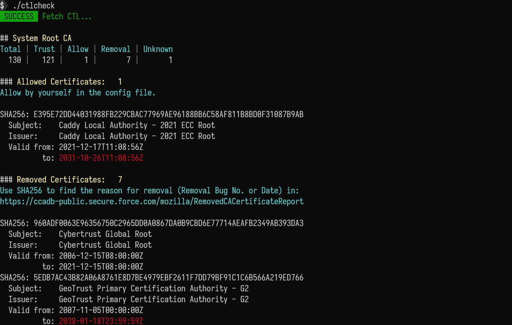

# ctlcheck [](https://godoc.org/github.com/canstand/ctlcheck) [](https://goreportcard.com/report/github.com/canstand/ctlcheck)

A utility to check the certificate trust list (CTL).

- Compare the differences between the current system CAs and the latest data from [CCADB](https://www.ccadb.org/) (or [Apple](https://support.apple.com/en-us/HT209143), etc.)
- Shows certificates that have been removed by the vendor (Mozilla, Apple, Microsoft, etc.), and unknown certificates 
- Self-signed or company root certificates can be added to the allow list



## Installation

First install [Go](http://go.dev).

If you just want to install the binary to your current directory and don't care about the source code, run

```bash
GOBIN="$(pwd)" go install github.com/canstand/ctlcheck@latest
```

If needed, create a `ctlcheck.yml` file and add your trusted self-signed root certificates in the following format: 

```yaml
allow:
    D59C2F2036FAF503FCDE00B6412318548D75F67D1F93A9953132EB6963B8CA19: Self Signed CA
    E395E72DD44031988FB229CBAC77969AE96188BB6C58AF811B8BD0F31087B9AB: Caddy Local Authority - 2021 ECC Root
```

## Usage

```
Usage:
  ctlcheck [options]

Options:
  -offline
        load data from ctlcheck.yml instead of fetch from CCADB
  -raw
        print unstyled raw output (set it if output is written to a file)
  -save
        save data to ctlcheck.yml
```

## Notes

### For Windows
**Why are there several Removed Certificates reported in normal Windows OS?**

* The CTL is based on [CCADB](https://ccadb-public.secure.force.com/microsoft/IncludedCACertificateReportForMSFT) data, and then complements several missing Microsoft built-in certificates from [authroot.stl](http://ctldl.windowsupdate.com/msdownload/update/v3/static/trustedr/en/authroot.stl). 
* Some certificates are included in authroot.stl, but the "Microsoft Status" has been marked as **Disable** or other status in [CCADB](https://ccadb-public.secure.force.com/microsoft/IncludedCACertificateReportForMSFT).